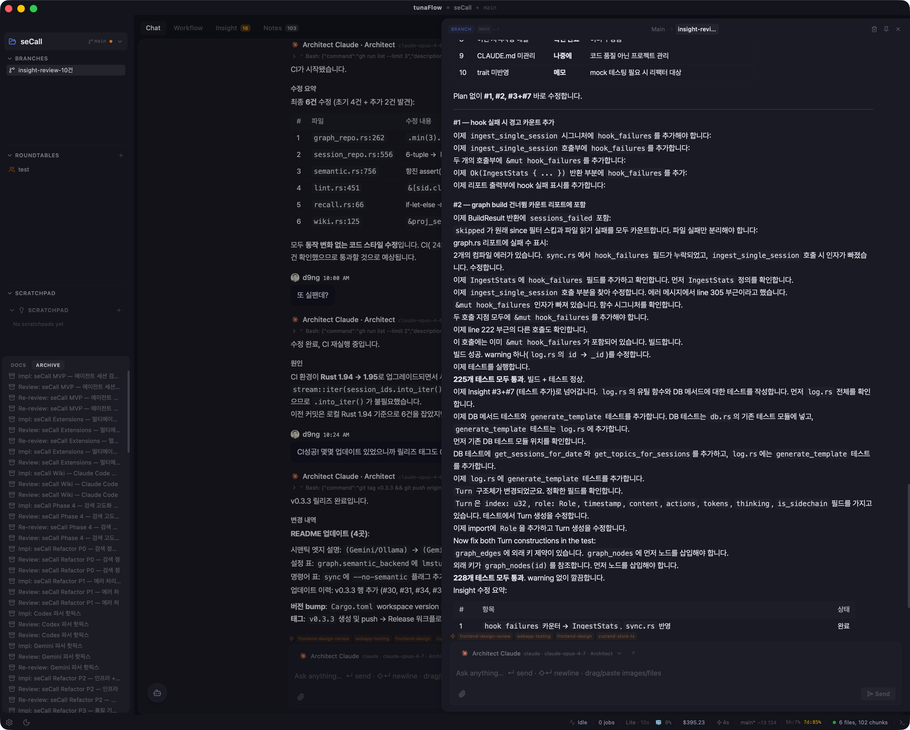

<div align="center">

# tunaFlow

**Claude Code · Codex · Gemini · OpenCode 를 한 화면에서 — plan · branch · review 까지.**

[](https://github.com/hang-in/tunaFlow/actions/workflows/ci.yml)
[](https://v2.tauri.app/)
[](https://react.dev/)
[](https://www.rust-lang.org/)
[](./LICENSE)
[](./docs/plans/publicReadinessChecklistPlan.md)

[](./README.md)
[](./README.ko.md)

> **Of the agent, By the agent, For the agent**

tmux 로 CLI 여러 개 오가는 피로에서 벗어나는 데스크톱 앱. Claude Code / Codex / Gemini / OpenCode 를 단일 Plan → Dev → Review 워크플로우 안에서 함께 운영합니다.

</div>



---

## 누구를 위한 도구인가

- Claude Code, Codex, Gemini CLI를 쓰면서 **대화 이상의 작업 구조**가 필요한 사람
- 에이전트에게 실행을 맡기되 **방향과 판단은 직접 유지**하고 싶은 사람
- AI 에이전트를 일상적인 개발 워크플로우에 넣으려는 소규모 팀 또는 개인

### 왜 만들어졌나

tunaFlow 는 구체적 고통에서 시작됐습니다 — Claude Code / Codex / Gemini CLI 를 동시에 쓸 때 tmux / iTerm / cmux 등 터미널에서 복붙으로 반복하는 작업이 많다는 것. 각 엔진은 강력한데 워크플로우는 수동 조립이었습니다. tunaFlow 는 그 조립을 한 화면 안에 묶어, 사용자의 주의가 "터미널 pane 관리" 가 아니라 "의도" 에 머물게 합니다.

---

## 설계 특징

### Engine Parity — 엔진 전환해도 프롬프트 다시 안 씀
Claude · Codex · Gemini · Ollama 네 엔진이 단일 조립 함수 `build_normalized_prompt_with_budget()` 를 경유합니다. identity · recent context · 장기기억 · 스킬 · 도구 결과가 엔진 무관하게 동일한 ContextPack 으로 조립되므로, 엔진 변경은 프롬프트 재작성이 아니라 한 줄 토글입니다.

### Blind Cross-verification — Plan 결함을 구현 전에 잡음
Plan 은 Architect(Claude Opus) 가 작성하고, 독립된 Reviewer(Codex, blind) 가 `invariant_checks` + 4차원 루브릭(plan_coverage · code_quality · test_coverage · convention) 으로 검증합니다. 설계 단계 BLOCKER 를 라운드 단위로 수렴시켜 구현 비용이 큰 재작업을 줄입니다.

### Branch-adopt 모델 — 대화 트리가 폭증하지 않음
같은 주제를 여러 에이전트에게 **Branch** 로 분기해 실험하고, 결과가 만족스러우면 **adopt** — 요약만 main 대화에 주입합니다. 사이드 분기의 전체 전사가 main 을 오염시키지 않으므로 대화는 결론 흐름만 유지됩니다. Roundtable(RT) 도 이 Branch 의 확장.

### CLI-first — 구독 요금제 내에서 최대치
기본 경로는 Claude Code / Codex / Gemini **CLI**. SDK(API 과금) 는 fallback 으로만 씁니다. 이미 구독 중인 사용자가 추가 토큰 비용 없이 모든 기능을 쓸 수 있도록 설계됐습니다.

### 품질 우선 — tunaFlow 는 토큰 절약 도구가 아님
결과물 품질이 최우선입니다. identity 문서 / worldview / 분석 요약 같은 맥락 자료는 agent 응답 품질에 기여하면 **AGENTS.md 수준 (1,500~3,000 tokens)** 으로 풍부하게 허용합니다. 대신 회피하는 낭비 축은 **중복** — 이미 claude 세션 버퍼에 있는 컨텍스트를 tunaFlow 가 또 주입하거나, stale 한 압축본이 현재 요청에 섞이거나, 같은 정보가 여러 섹션에 복사되는 것. 여기서 "lean" 은 "극단 압축" 이 아니라 **"중복 없음"** 입니다.

---

## 주요 기능

### Orchestration Workflow

Architect → Developer → Reviewer 3-role 시스템.
Plan을 설계하면 Developer가 구현하고, Reviewer가 교차 검증합니다.
실패 시 findings를 분석해 rev.N+1 Plan을 자동 제안합니다.

### Quick / Deep Review

- **Quick**: 단일 Reviewer가 빠르게 검증
- **Deep**: 복수 엔진이 Roundtable로 교차 검증 + 테스트 자동 주입. 4차원 루브릭(plan_coverage · code_quality · test_coverage · convention) + invariant_checks 기반 평가. Reviewer 는 Architect 와 다른 vendor(blind) 로 배정.

### Interactive Session

`-p` 일회성 플래그 없이 CLI 에이전트와 **지속 세션**을 유지합니다. 파일 수정, 명령 실행 등 에이전트의 전체 도구 사용이 가능하며, 세션이 살아있는 한 tunaFlow 가 컨텍스트를 중복 주입하지 않습니다 (claude `--sdk-url` WebSocket 기본 경로 + PTY legacy 폴백).

### Roundtable (RT)

여러 엔진의 에이전트가 하나의 주제로 토론합니다. Sequential(순차) 또는 Deliberative(동시) 모드. 모든 RT는 Branch의 확장입니다.

### ContextPack

4개 엔진 공통 프롬프트 조립 엔진. Lite / Standard / Full 자동 Tiering. rawq 코드 검색, 장기기억, 실패 학습, 역할 문서를 맥락에 포함합니다.

### Insight

rawq + code-review-graph가 사전 추출한 데이터를 에이전트에게 분석시킵니다. 안정성 · 테스트 · 아키텍처 · 성능 · 보안 · 기술부채 6개 카테고리. Quick Wins 자동 수정 지원.

### 메타 에이전트 온보딩

첫 프로젝트 설정 시 사용 가능한 에이전트를 자동 감지하고, 프로젝트 스택에 맞는 에이전트 구성을 추천합니다.

---

## 지원 엔진

| 엔진 | 연동 방식 |
|------|----------|
| Claude (Anthropic) | CLI subprocess + WebSocket sdk-session (지속 세션) |
| Codex (OpenAI) | CLI subprocess + app-server (stateful thread) |
| Gemini (Google) | CLI subprocess |
| Ollama / LM Studio / vLLM | HTTP SSE (OpenAI-compatible) |

---

## 설치 및 실행

### 사전 준비

- macOS (현재 macOS 전용)
- Node.js 20+, Rust stable
- 에이전트 CLI 1개 이상:

```bash
npm install -g @anthropic-ai/claude-code   # Claude
npm install -g @openai/codex               # Codex
npm install -g @google/gemini-cli          # Gemini
```

### 개발 실행

```bash
git clone https://github.com/hang-in/tunaFlow.git
cd tunaFlow
npm install
npm run tauri dev
```

### 빌드

```bash
./scripts/build.sh
```

### 베타 설치 (macOS)

```bash
curl -fsSL https://raw.githubusercontent.com/hang-in/tunaFlow/main/install.sh | bash
```

> macOS ad-hoc 서명이므로 Gatekeeper 경고가 뜰 수 있습니다.
> `xattr -cr /Applications/tunaFlow.app` 으로 해제합니다.

---

## 기술 스택

Tauri 2 + React 18 + TypeScript + Zustand 5 + Tailwind CSS 4 + Rust + SQLite (WAL, v30)

코드 검색: rawq sidecar (bge-m3 임베딩) · code-review-graph · context-hub
외부 연동: HTTP API + WebSocket · MCP 서버 (`tunaflow-mcp`)

---

## 문서

| 문서 | 내용 |
|------|------|
| [CLAUDE.md](./CLAUDE.md) | 아키텍처, 컨벤션, 핸드오프 |
| [Architecture Detail](./docs/reference/architecture-detail.md) | RT 흐름, Store 구조, DB 스키마 |
| [Implementation Status](./docs/reference/implementationStatus.md) | 기능별 구현 현황 |
| [Beta Release Plan](./docs/plans/betaReleaseReadinessPlan.md) | 배포 준비 체크리스트 |
| [Dev History](./docs/reference/devHistory.md) | 프로젝트 계보 + 개발 이력 |
| [Session History](./docs/reference/sessionHistory.md) | 세션별 상세 이력 (최근 설계 결정 추적용) |

---

## 알려진 제약 (Beta)

### 해결 예정 (P0 / P1)

- **PTY 터미널 — 작업 중** — 인앱 터미널 패널은 Beta 번들에서 일시적으로 비활성화되어 재구성 중입니다. 후속 릴리즈에서 복원되기 전까지는 외부 터미널 (iTerm2 / Terminal.app / Warp) 을 병행 사용하세요.
- **JSONL 완료 감지 실패 (P1)** — PTY 세션에서 응답이 UI 에 반영되지 않는 경우 간헐적 발생 (sdk-session WebSocket 경로로 이동 중).
- **Windows / Linux 빌드** — 미지원. 패키징 파이프라인 준비 중.

### 설계상 / Beta 단계

- **ad-hoc 서명** — Beta 에서는 Apple Developer ID 서명 없음. Gatekeeper 경고 해제 필요 (`xattr -cr /Applications/tunaFlow.app`).
- **RT 중간 스트리밍 미지원** — Roundtable 은 라운드 단위로만 결과 표시 (구조적 — 변경 시 대규모 재배선 필요).
- **최초 인덱싱 지연** — 대규모 프로젝트 최초 1회 수 분 소요 (ONNX 스레드 제한 + 세마포어 + 점진적 인덱싱 적용 후 CPU 스파이크는 완화됨).

자세한 목록: [CLAUDE.md §5](./CLAUDE.md)

---

## 도움말 / 단축키

앱 내부 `Settings > Help` 패널에 주요 단축키, 기능 요약, 문제 해결 팁이 정리되어 있습니다.

---

## tunaFlow 로 만든 프로젝트

tunaFlow 의 멀티 에이전트 오케스트레이션 워크플로우로 개발한 프로젝트:

- **[secall](https://github.com/hang-in/secall)** — AI 대화를 위한 하이브리드 검색 "second brain". Andrej Karpathy 의 LLM wiki 개념을 CJK 환경에 맞게 변형한 것.

---

## References & Acknowledgments

tunaFlow 는 여러 오픈소스 프로젝트의 아이디어와 코드를 참고했습니다. 각 메인테이너에게 감사드립니다.

### 번들 사이드카 (앱과 함께 배포)

- **[rawq](https://github.com/auyelbekov/rawq)** (MIT) — 코드 검색 사이드카. tunaFlow 는 로컬 패치 빌드를 번들로 포함.
- **[code-review-graph](https://github.com/tirth8205/code-review-graph)** (MIT) — CRG 사이드카 (Full 트랙). 그래프 기반 코드 리뷰 분석.
- **[context-hub](https://github.com/andrewyng/context-hub)** (MIT) — 컨텍스트 공유 사이드카. 첫 실행 시 자동 설치.

### 설계 / 아키텍처 영향

- **[abtop](https://github.com/graykode/abtop)** (MIT) — AI 코딩 에이전트의 런타임 관측성 / 진단. Trace 패널과 상태바 디자인에 영향.
- **[hermes-agent](https://github.com/NousResearch/hermes-agent)** (MIT) — memory / toolset / iteration-budget 패턴.
- **[larksuite-cli](https://github.com/larksuite/cli)** (MIT) — CLI action layering / shared-rule / async-contract 패턴.
- **[chops](https://github.com/Shpigford/chops)** (MIT) — ContextPack code-slice 주입 아이디어.
- **[codex](https://github.com/openai/codex)** (Apache 2.0) — CLI 에이전트 프로토콜 참조 구현.
- **[xterm.js](https://xtermjs.org/)** (MIT) — PTY 패널 터미널 렌더링.
- **[react-markdown](https://github.com/remarkjs/react-markdown)** (MIT) — 채팅 마크다운 렌더링.
- **[D2Coding](https://github.com/naver/d2codingfont)** (OFL 1.1) — 번들된 고정폭 폰트.
- **[Tauri](https://tauri.app/)** (MIT / Apache 2.0) — 데스크탑 셸 프레임워크.

전체 참고 프로젝트 25+ 개 목록은 **[ACKNOWLEDGMENTS.md](./ACKNOWLEDGMENTS.md)** 에서 확인할 수 있습니다. 제3자 라이선스 표기 전문은 [NOTICE](./NOTICE) 참조.

### 철학 / 아티클

- **[Code Agent Orchestra](https://addyosmani.com/blog/code-agent-orchestra/)** by Addy Osmani — tunaFlow 의 멀티 에이전트 오케스트레이션 철학에 영향.
- Stavros Korokithakis 의 Claude Code 워크플로우 포스트 — `Plan → Dev → Review` 파이프라인 영감.

---

## 연락처

- Email: d9ng@outlook.com
- Issues: https://github.com/hang-in/tunaFlow/issues
- Security: [SECURITY.md](./SECURITY.md) 참조

---

*100% AI-authored codebase — Claude Code 가 모든 라인을 작성했으며, 사람은 아키텍처와 방향만 결정합니다.*

---
🇺🇸 [English](./README.md) · 🇰🇷 한국어
